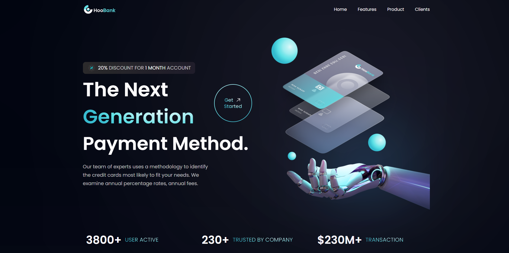

# HooBank Website Showcase

Welcome to the repository for the HooBank website project! This project showcases my skills in frontend development using React and Vite, demonstrating my ability to create a cutting-edge, secure, and user-friendly platform for financial services.

You can view the live website here: [HooBank](https://hoobusiness.website/)



## Table of Contents

- [Features](#features)
- [Technologies Used](#technologies-used)
- [Installation](#installation)

## Features

- **Modern Design:** A sleek, modern interface that emphasizes usability and aesthetic appeal.
- **Secure Payment Integration:** Robust security measures to ensure safe and secure transactions.
- **Interactive Dashboard:** A dynamic, interactive dashboard for users to manage their financial activities effortlessly.
- **Responsive Layout:** Ensures a seamless experience across all devices, from desktops to mobile phones.

## Technologies Used

- **React:** A JavaScript library for building user interfaces.
- **Vite:** A modern frontend build tool that significantly improves the development experience.
- **CSS:** For styling and animation effects to enhance the UI/UX.
- **JavaScript:** The programming language used to make the website interactive.
- **Node.js:** A runtime environment for executing JavaScript on the server side.
- **Bootstrap:** A CSS framework used for developing responsive and mobile-first websites.
- **Sass:** A preprocessor scripting language that is interpreted or compiled into Cascading Style Sheets (CSS).
- **Webpack:** A module bundler for JavaScript applications.
- **Babel:** A JavaScript compiler that lets you use next-generation JavaScript, today.
- **Axios:** A promise-based HTTP client for making requests to external servers from the web browser.

## Installation

To run this project locally, follow these steps:

1. **Clone the repository:**
   ```sh
   https://github.com/attiamohmed/HooBank_Business_Website
